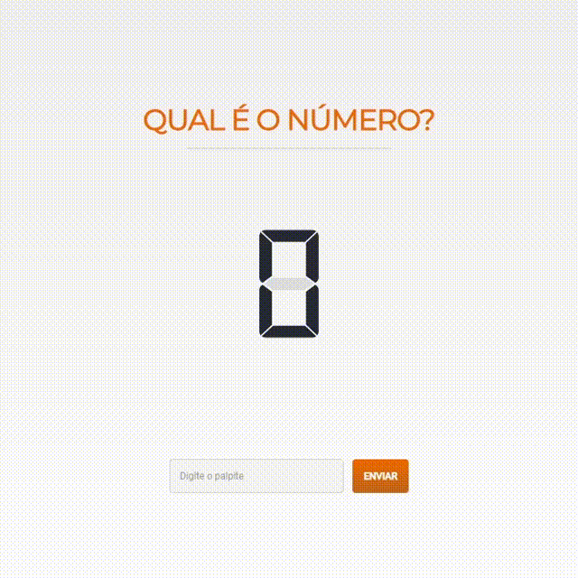

# 

#  Qual é o número?

O projeto realizado como desafio de um processo seletivo para Front-End Júnior.

------

### :rocket: Link de acesso:

<a href="https://thalesnunes.com.br/pequenos-projetos/qual-e-o-numero/" target="_blank">Clique aqui...</a>

------

### :rocket: Funcionalidades:

   

- O usuário deve acertar qual é o número desejado.
- Usuário insere um número de 1 a 300.
- O número é inserido em um painel led com dígitos montados em SVG.
- Verifica se o número é maior, menor ou igual ao desejado e notifica o usuário.
- Caso seja igual, o usuário vence e o jogo pode ser reiniciado.

------

### :rocket: Recursos utilizados:

- Foi utilizado uma API para gerar o número a ser adivinhado e eventualmente algum erro proposital.
- Caso gere um número o jogo é iniciado e caso gere um erro, o mesmo é informado ao usuário.
- Painel de LED feito com SVG é montado a partir do numero inserido.
- Boas práticas de UI como Pixel Perfect e Responsividade.
- Entre outros...

------

### :rocket: Preview:

 </img>

------

###  :rocket: Contato:

Alguma dúvida, crítica ou elogio? Não hesite em entrar em contato. Será um prazer conversar a respeito!

 [Whatsapp](https://api.whatsapp.com/send?phone=5535997438652) |  [E-mail](mailto:thales.o.nunes@gmail.com)
